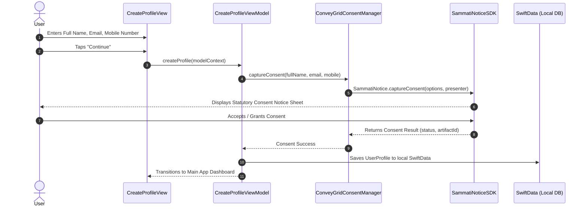

# MoneyTrax 💰📊

[](https://developer.apple.com/ios/)
[](https://swift.org)
[](https://developer.apple.com/documentation/swiftdata)
[](https://rysun-harshilbhatt.github.io/MoneyTrax/)
[](https://rysun-harshilbhatt.github.io/MoneyTrax/support.html)
[]()

**MoneyTrax** is a privacy-first, local-first daily expense and income tracking application built with **SwiftUI** and **SwiftData**. It is engineered to help users effortlessly record daily expenses, track income streams, set categorized monthly budgets, and analyze spending habits with interactive charts.

MoneyTrax also serves as a premier reference implementation for integrating the **Sammati Notice SDK (ConveyGrid)**—demonstrating how modern mobile applications can seamlessly achieve DPDP (Digital Personal Data Protection) and regulatory privacy consent compliance.

---

## 🌟 Key Features

- **📱 Local-First Architecture:** 100% of financial entries, categories, and monthly budgets are stored locally on the user's device using Apple's SwiftData framework.
- **💸 Daily Expense Tracking:** Quick logging of daily expenditures categorized with custom icons, payment methods (Cash, Card, UPI, Net Banking), and notes.
- **💵 Income Management:** Record and organize multiple revenue streams (Salary, Freelance, Investment, Business).
- **🎯 Category Budgeting:** Set monthly spending thresholds per category with visual budget progress indicators.
- **📈 Interactive Reports & Charts:** Comprehensive financial breakdowns and monthly trends powered by Apple's `Charts` framework.
- **🔒 Privacy First & Zero Tracking:** No third-party advertisements, no ad trackers, and no analytics SDKs.
- **🛡️ Statutory Consent Management:** Built-in DPDP-compliant notice and consent workflow powered by **Sammati Notice SDK (ConveyGrid)**.

---

## 🚀 Live Links & Resources

| Resource | URL |
| :--- | :--- |
| **Official Privacy Policy** | [https://rysun-harshilbhatt.github.io/MoneyTrax/](https://rysun-harshilbhatt.github.io/MoneyTrax/) |
| **Help & Support Center** | [https://rysun-harshilbhatt.github.io/MoneyTrax/support.html](https://rysun-harshilbhatt.github.io/MoneyTrax/support.html) |
| **Data Deletion Request** | [https://rysun-harshilbhatt.github.io/MoneyTrax/support.html#data-deletion](https://rysun-harshilbhatt.github.io/MoneyTrax/support.html#data-deletion) |
| **Developer Website** | [https://www.rysun.com](https://www.rysun.com) |
| **Support Email** | [kcspldoc@gmail.com](mailto:kcspldoc@gmail.com) |

---

## 🏗️ Project Architecture

```
MoneyTrax/
├── App/
│   ├── MoneyTraxApp.swift               # App entrypoint & SwiftData model container
│   ├── AppState.swift                   # Global state management
│   └── ContentView.swift                # Root view switcher (Onboarding vs Main TabView)
├── Core/
│   ├── Constants.swift                  # Categories, Currencies & ConveyGrid Config
│   ├── Extensions/                      # Swift & SwiftUI helper extensions
│   └── Utilities/                       # Input validators & formatting utilities
├── Models/
│   ├── UserProfile.swift                # User profile model (Name, Email, Mobile)
│   ├── Expense.swift                    # Expense record model
│   ├── Income.swift                     # Income record model
│   ├── Budget.swift                     # Monthly category budget limits
│   ├── ExpenseCategory.swift            # Default and user custom categories
│   └── PaymentMethod.swift              # Payment types enum (Cash, Card, UPI, etc.)
├── Repositories/
│   ├── UserProfileRepository.swift      # Local data CRUD & complete deletion
│   ├── ExpenseRepository.swift          # Expense queries & mutations
│   ├── IncomeRepository.swift           # Income queries & mutations
│   └── BudgetRepository.swift           # Budget progress calculations
├── Features/
│   ├── Onboarding/                      # Welcome & Profile creation with Consent UI
│   ├── Dashboard/                       # Spending summary, balance card & quick actions
│   ├── Expenses/                        # Add, edit, and view expenses
│   ├── Income/                          # Add, edit, and view income records
│   ├── Transactions/                    # Unified transaction history & filtering
│   ├── Budget/                          # Budget setup & category progress bars
│   ├── Reports/                         # Visual spending analytics & pie charts
│   └── Settings/                        # Currency, categories, privacy policy & profile deletion
├── Integrations/
│   ├── ConsentIntegrationProtocol.swift # Abstraction layer for consent managers
│   └── ConveyGridConsentManager.swift   # SammatiNoticeSDK integration wrapper
└── Resources/
    ├── PrivacyInfo.xcprivacy            # Apple Privacy Manifest
    └── Assets.xcassets                  # Icons, accent colors & launch screen
```

---

## 🔐 Sammati Notice SDK (ConveyGrid) Integration

The **Sammati Notice SDK** enables apps to present statutory privacy notices, collect verifiable user consent, and fulfill statutory DPDP / GDPR regulatory recordkeeping requirements without compromising user experience.

### 1. How Sammati SDK is Integrated in MoneyTrax

In MoneyTrax, user onboarding requires capturing statutory consent before profile creation:



---

## 🛠️ Step-by-Step: Integrating Sammati Notice SDK in Any iOS App

Follow this guide to integrate the Sammati Notice SDK into any iOS application.

### Step 1: Add the SDK Dependency

In your `Package.swift` or Xcode Project dependencies (**File → Add Package Dependencies...**), add the `SammatiNoticeSDK` package:

```swift
// Package.swift
dependencies: [
    .package(url: "https://github.com/conveygrid/conveygrid-ios-sdk.git", from: "1.0.0")
]
```

Or via local path (for development):
```yaml
packages:
  SammatiNoticeSDK:
    path: "path/to/conveygrid-ios-sdk"
```

---

### Step 2: Initialize & Configure the SDK

Initialize `SammatiNotice` early in your app lifecycle (e.g., in your `@main` App struct or `AppDelegate`):

```swift
import SwiftUI
import SammatiNoticeSDK

@main
struct YourApp: App {
    init() {
        configureSammatiSDK()
    }

    var body: some Scene {
        WindowGroup {
            ContentView()
        }
    }

    private func configureSammatiSDK() {
        let theme = NoticeTheme(
            primaryColor: "#2E57F5",
            secondaryColor: "#10B981",
            fontFamily: "System"
        )

        let configuration = SammatiConfiguration(
            clientId: "YOUR_CLIENT_ID",          // e.g. samapp_xxxxxxxxxxxx
            origin: "https://api.conveygrid.com/", // API endpoint
            environment: .sandbox,               // .sandbox or .production
            theme: theme,
            debugMode: true
        )

        SammatiNotice.configure(configuration)
    }
}
```

---

### Step 3: Implement a Consent Manager Wrapper

Create a dedicated manager to encapsulate UI discovery, parameters, and error handling:

```swift
import Foundation
import UIKit
import SammatiNoticeSDK

final class ConveyGridConsentManager {
    static let shared = ConveyGridConsentManager()
    
    var noticeCode: String = "NOTICE_001"

    private init() {}

    @MainActor
    func captureConsent(fullName: String, email: String, mobile: String) async throws {
        // 1. Dismiss active software keyboard
        UIApplication.shared.sendAction(#selector(UIResponder.resignFirstResponder), to: nil, from: nil, for: nil)
        try? await Task.sleep(nanoseconds: 50_000_000)

        // 2. Locate the topmost UIViewController
        guard let presenter = getTopViewController() else {
            throw NSError(domain: "ConsentManager", code: -1, userInfo: [NSLocalizedDescriptionKey: "Top view controller not found."])
        }

        // 3. Configure consent options
        let options = ConsentOptions(
            noticeCode: noticeCode,
            email: email.isEmpty ? nil : email,
            mobile: mobile.isEmpty ? nil : mobile,
            fullName: fullName.isEmpty ? nil : fullName,
            theme: NoticeTheme(
                primaryColor: "#2E57F5",
                secondaryColor: "#10B981"
            )
        )

        // 4. Trigger the consent sheet
        let result = try await SammatiNotice.captureConsent(options: options, presenter: presenter)
        print("Consent captured successfully! Artifact ID: \(result.artifactId ?? "none")")
    }

    // Helper: Find top UIViewController in SwiftUI hierarchy
    @MainActor
    private func getTopViewController() -> UIViewController? {
        guard let scene = UIApplication.shared.connectedScenes.first(where: { $0.activationState == .foregroundActive }) as? UIWindowScene,
              let window = scene.windows.first(where: { $0.isKeyWindow }) ?? scene.windows.first else {
            return nil
        }
        var topController = window.rootViewController
        while let presented = topController?.presentedViewController, !presented.isBeingDismissed {
            topController = presented
        }
        return topController
    }
}
```

---

### Step 4: Trigger Consent in your SwiftUI ViewModel / View

Bind the consent capture action to your onboarding or sign-up trigger:

```swift
@MainActor
func onUserSignUp() {
    isLoading = true
    
    Task {
        do {
            // Capture consent before persisting user account
            try await ConveyGridConsentManager.shared.captureConsent(
                fullName: self.fullName,
                email: self.email,
                mobile: self.mobileNumber
            )
            
            // Proceed with account setup
            self.saveUserDataLocally()
            self.navigateToDashboard()
        } catch {
            print("Consent failed or dismissed: \(error.localizedDescription)")
            self.errorMessage = error.localizedDescription
            self.showError = true
        }
        self.isLoading = false
    }
}
```

---

## 📋 Privacy & Data Safety Summary

| Question / Field | Declaration |
| :--- | :--- |
| **Financial Records Storage** | 100% On-Device (Local SwiftData storage). Never uploaded. |
| **Personal Identifiers** | Name, Email, Mobile number used for profile identity & consent auditing. |
| **Consent SDK Processing** | Transmitted over TLS/HTTPS directly to ConveyGrid API for statutory notices. |
| **Third-Party Ads & Tracking** | **None**. Zero ad SDKs and zero analytics platforms. |
| **In-App Account Deletion** | Available at **Settings → Delete Profile**. |
| **Web Data Deletion URL** | `https://rysun-harshilbhatt.github.io/MoneyTrax/support.html#data-deletion` |

---

## 🛠️ Build & Requirements

- **macOS:** 14.0+ (Sonoma or later recommended)
- **Xcode:** 15.0+
- **iOS Target:** iOS 17.0+
- **Language:** Swift 5.9+
- **Project Generator:** [XcodeGen](https://github.com/yonaskolb/XcodeGen) (Run `xcodegen generate` to create `.xcodeproj`)

```bash
# Generate Xcode project using XcodeGen
xcodegen generate

# Open in Xcode
open MoneyTrax.xcodeproj
```

---

## 📄 License & Legal

Developed by **Rysun**. All rights reserved.  
For technical support or inquiries, email [kcspldoc@gmail.com](mailto:kcspldoc@gmail.com) or visit [https://www.rysun.com](https://www.rysun.com).
